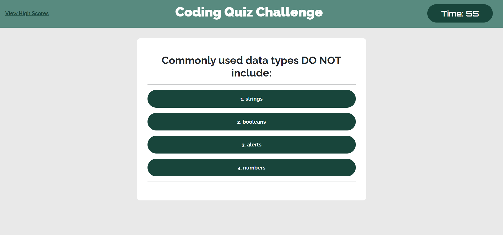

# Code Quiz

### Quiz Functionality
- Timer starts after clicking "Start Quiz" button
- Displays quiz questions, moving onto the next one after user answers
- Notifies the user if answered correct or incorrect
- If user answers incorrect 10 seconds is deducted from the timer
- Quiz is ended after the last question is answered or timer runs out
- User is able to enter their initials and store their score in Local Storage and will be able to view it after refreshing the page

